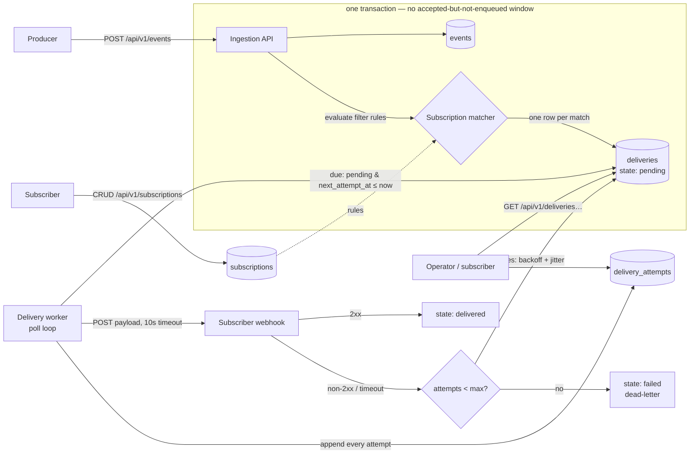

# Event Fanout Service

Event ingestion and notification fanout: accepts structured events over REST, matches them
against subscriber filter rules, and delivers matching events to registered webhook endpoints
with retries, dead-lettering, and a queryable delivery audit trail.

> **Status.** Core is complete: durable idempotent ingestion, subscription management with
> validated filter rules, the retrying delivery worker, and the delivery audit API — all
> covered by the test suite (webhook traffic fully mocked with respx).

## Setup

Requires Python 3.12+.

```bash
make install   # pip install -e ".[dev]"
make run       # uvicorn on http://localhost:8080 (docs at /docs)
make test      # pytest
make lint      # ruff
make docker-build && make docker-run
```

Smoke test:

```bash
curl localhost:8080/health
curl -X POST localhost:8080/api/v1/events \
  -H 'Content-Type: application/json' \
  -d '{"id": "evt-1", "type": "order.created", "source": "checkout", "payload": {"amount": 250}}'
# → 202 {"event_id": "evt-1", "duplicate": false}; repeat → {"duplicate": true}
```

## Architecture



The `deliveries` table is a DB-backed queue: ingestion writes the event **and** its pending
deliveries in one transaction, the worker polls for due rows, and every webhook attempt appends
an audit row. Swapping the queue backbone to Redis Streams/Kafka (the listed extension) replaces
only the worker's "find due deliveries" mechanism; the state machine and audit trail are
unchanged.

## API

| Method | Path | Notes |
|---|---|---|
| `GET` | `/health` | Liveness; fast, no dependencies |
| `POST` | `/api/v1/events` | Ingest an event → `202 {event_id, duplicate}` |
| `POST` | `/api/v1/subscriptions` | Register webhook URL + filter rules → `201`; invalid rules → `422` |
| `GET` | `/api/v1/subscriptions` | List active subscriptions |
| `DELETE` | `/api/v1/subscriptions/{id}` | Delete (soft) → `204`; unknown id → `404` |
| `GET` | `/api/v1/deliveries?event_id=…&subscription_id=…` | Delivery state per event and/or subscription (at least one filter required) |
| `GET` | `/api/v1/deliveries/{id}/attempts` | Audit: final state + timestamp, HTTP status, error for every attempt |

**Ingestion contract.** Body: `{id?, type, source, payload}` where `payload` is any JSON object.
`id` is an optional client-supplied idempotency key (max 128 chars); the server generates a UUID
when absent. Replaying an `id` returns `202` with `"duplicate": true` and does not re-enqueue —
the original event is kept even if the replayed body differs. `202` is returned only after the
event and its fanout rows are committed. Every response carries an `X-Request-ID` header.

**Webhook delivery contract.** Matching events are POSTed to the subscription URL as
`{"event_id", "type", "source", "payload"}` with `X-Delivery-Id` / `X-Event-Id` headers.
Any 2xx response acknowledges the delivery; anything else (including timeouts after
`WEBHOOK_TIMEOUT_S`) triggers a retry. Deliveries are at-least-once — receivers should treat
`event_id` as an idempotency key.

## Delivery guarantees

**At-least-once per subscriber**, by construction:

- The event and its pending `deliveries` rows commit in a single transaction before the `202`,
  so an accepted event cannot miss fanout.
- A delivery is marked `delivered` only after a 2xx response. If the service crashes after the
  webhook call but before the state update, the delivery is retried — the subscriber sees the
  event **again**. Subscribers must dedupe on `event_id`.
- Failures (non-2xx, timeout) are retried with exponential backoff + jitter up to
  `MAX_DELIVERY_ATTEMPTS`, then parked as `failed` — a queryable dead-letter state, never a
  silent drop.

Failure conditions: *at-most-once* would lose events on crash-after-send-marked-early;
*exactly-once* is unattainable over plain HTTP webhooks without receiver cooperation
(idempotency keys are that cooperation — we provide `event_id` for it). The loss modes that
remain here are: durable storage loss (single SQLite file — see tradeoffs) and events parked as
`failed` after max attempts, which stay visible for replay/inspection rather than vanishing.

## Filter rule syntax

Rules are validated at subscription creation; invalid rules are rejected with `422`.

```json
{
  "url": "https://example.com/hook",
  "rules": {
    "type": "order.created",
    "source": "checkout",
    "payload": [
      {"path": "amount", "op": "gt", "value": 100},
      {"path": "customer.tier", "op": "eq", "value": "gold"}
    ]
  }
}
```

- `type` / `source`: optional exact-match strings; omitted means "match any".
- `payload`: optional list of conditions, **all** of which must hold (AND).
  - `path` — dot-separated path into the payload object (`customer.tier`).
  - `op` — one of `eq`, `neq`, `gt`, `gte`, `lt`, `lte`, `exists`.
  - `value` — comparison operand (omitted for `exists`); `gt`-family requires numbers.
- A missing path never matches (except `exists`, which is then false).

## Configuration

All via environment variables (see `app/core/config.py`):

| Variable | Default | Purpose |
|---|---|---|
| `DATABASE_URL` | `sqlite:///./data/events.db` | SQLAlchemy URL; Postgres is a value swap |
| `LOG_LEVEL` | `INFO` | JSON log verbosity |
| `WORKER_ENABLED` | `true` | `false` runs the API without the delivery poll loop |
| `WEBHOOK_TIMEOUT_S` | `10` | Per-attempt webhook timeout |
| `MAX_DELIVERY_ATTEMPTS` | `5` | Attempts before dead-lettering |
| `BACKOFF_BASE_S` | `2` | Exponential backoff base |
| `WORKER_POLL_INTERVAL_S` | `1` | Delivery worker tick interval |

## Deployment (DigitalOcean App Platform)

```bash
doctl auth init                          # one-time: paste a DO API token
doctl apps create --spec .do/app.yaml    # first deploy (~5-10 min)
doctl apps list                          # grab the app id + default URL
```

The spec builds the repo's Dockerfile from the public git source and health-checks `/health`.
Because it uses a plain git source (no DO GitHub-app authorization required), pushes do
**not** auto-deploy — redeploy with `doctl apps update <APP_ID> --spec .do/app.yaml`, or
switch to the `github:` source block (commented in the spec) after authorizing DO's GitHub
app to get `deploy_on_push`. Caveat: the SQLite database sits on the container's ephemeral
filesystem, so **data resets on each redeploy** — fine for a demo; the production fix is a
DO Managed Postgres with `DATABASE_URL` set in the app spec (the repo layer needs no code
change).

## What we sacrifice for simplicity vs. what we'd harden next

**Sacrificed deliberately (fine for this exercise):**

- **SQLite as both store and queue.** Zero setup, durable in a container volume, and the
  repository layer keeps SQL in one place so Postgres is a `DATABASE_URL` swap. Costs: single
  writer, no horizontal scaling of the worker, DB polling instead of push.
- **`create_all()` instead of Alembic migrations** — schema changes would need real migrations.
- **No auth/rate limiting on ingestion or subscription APIs.**
- **Webhook URLs taken as-is** — no SSRF protection (private-IP/localhost targets allowed), no
  signing of delivered payloads (subscribers can't verify sender).
- **In-process worker** — delivery throughput is coupled to the API process lifecycle.

**Harden next, in order:**

1. Postgres + Alembic; `SELECT … FOR UPDATE SKIP LOCKED` so multiple worker replicas can share
   the delivery queue safely.
2. Redis Streams or Kafka as the fanout backbone (the listed extension) once DB polling becomes
   the bottleneck; per-source partitioning also gives per-source ordering per subscriber.
3. HMAC-signed webhook payloads + SSRF guard on subscription URLs.
4. Auth (API keys per producer/subscriber) and rate limits.
5. Replay API (re-deliver a time range per subscriber) — the append-only `events` table already
   supports it.
6. Metrics (delivery lag, failure rate) on top of the structured logs.
